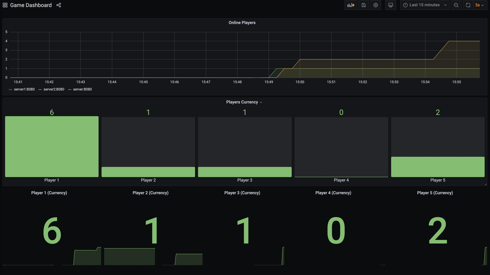
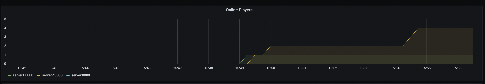
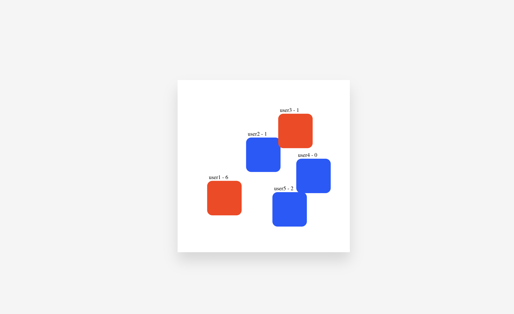

## ABOUT

The solution is showcasing real-time horizontaly scalable multiplayer game using MongoDB as a real-time database via [MongoDB Change Streams](https://www.mongodb.com/docs/manual/changeStreams/) to synchronize user state across all nodes.

[Socket.IO](https://socket.io/) is used for `client <-> server` communication.

The game supports custom mertircs which are scraped by [Prometheus](https://prometheus.io/) and displayed by custom Dashborad in [Grafana](https://grafana.com/)

## SCREENSHOTS

Game Dashboard




Show real-time connections to each server instance



The Game




## HOW THE GAME WORKS

This is a simple (really simple) multiplayer game in which when visiting the right bottom corner the user will gain coins.

**TO PLAY:**


```bash
$ cd src/

# Start all containers
$ docker-compose up

# Open the game in the browser
# uname - the user unique name used as playerId
# port - the server instance port which the client will use (default is 8080)
$ open http://localhost:3001/?uname=user1&port=8080
$ open http://localhost:3001/?uname=user2&port=8081
$ open http://localhost:3001/?uname=user3&port=8080
...

# Open Game Dashboard for real-time metrics
$ open http://localhost:3000/d/rBUL3h87z/game-dashboard?orgId=1&refresh=5s
```


## LINKS

- Grafana -> http://localhost:3000/d/rBUL3h87z/game-dashboard?orgId=1&refresh=5s
- Prometheus -> http://localhost:9090/targets
- Client -> http://localhost:3001/?uname=user1&port=8080